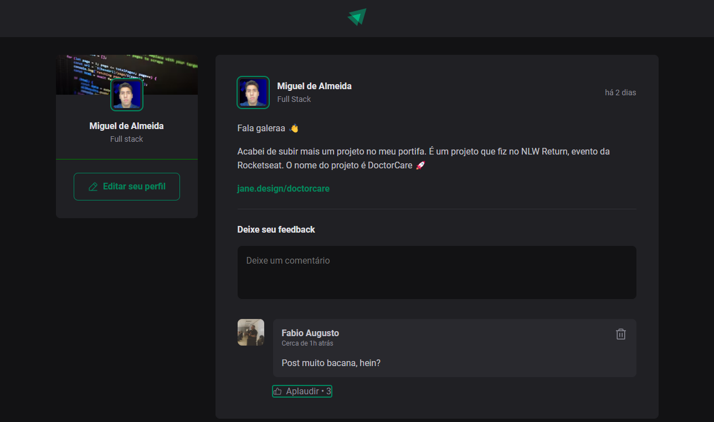
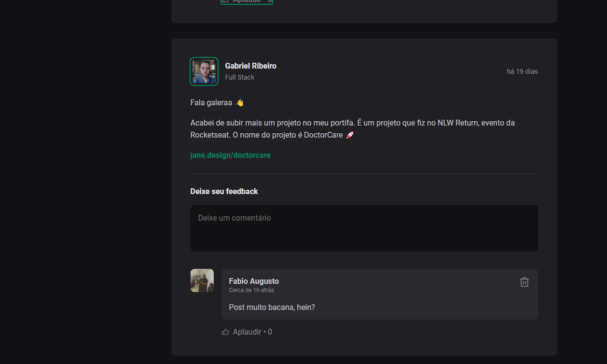
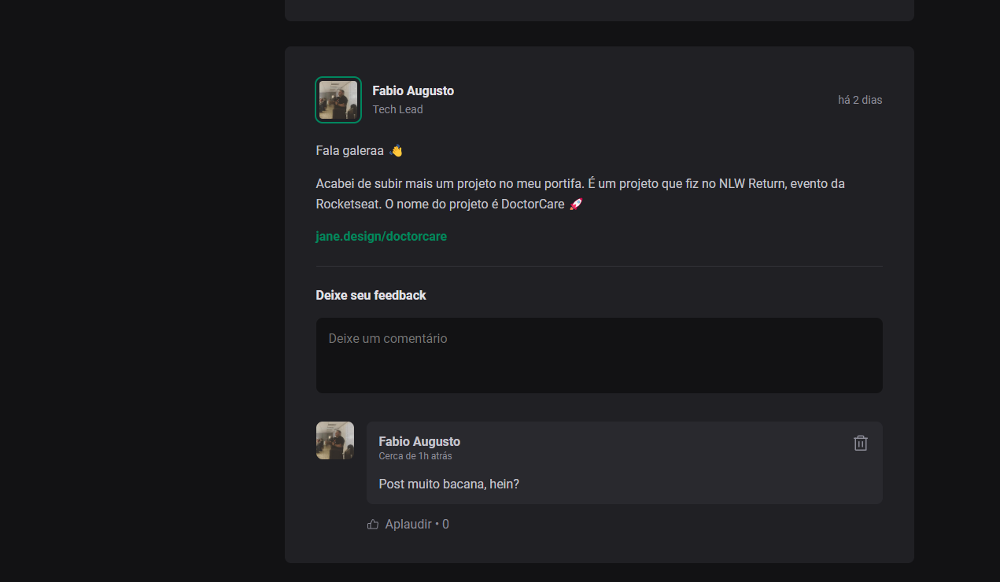

<a href="Readme.md" style="color:#B0E0E6;">Inglês</a> 


# Entrega de projeto - Criando um landing page com React | Rocketseat

Este projeto é uma aplicação de blog totalmente funcional construída usando React. O principal objetivo deste projeto é demonstrar como construir componentes e organizar efetivamente seu projeto React utilizando as ferramentas e recursos fornecidos pelo framework Vite.

## Tecnologias Utilizadas

- REACT
- CSS
- HTML

## Como Executar o Projeto

1. Clone o repositório:

   ```bash
   git clone https://github.com/Miguelalmeida01/typeScript-cursoIgnite.git
   ```

2. Navegue até o diretório do projeto:

   ```bash
   cd react
   ```

3. Instale as dependências:   

   ```bash
   npm i
   ```

4. baixar a biblioteca phosphor-react:

   ```bash
   npm i phosphor-react
   ```

5. Acesse o projeto no navegador:
   ```bash
   npm run dev
   ```

## Projeto na web






<a href="https://github.com/Miguelalmeida01/typeScript-cursoIgnite?tab=readme-ov-file#entrega-de-projeto---criando-um-blog-com-angular--dio" style="color:#B0E0E6">Voltar</a> 