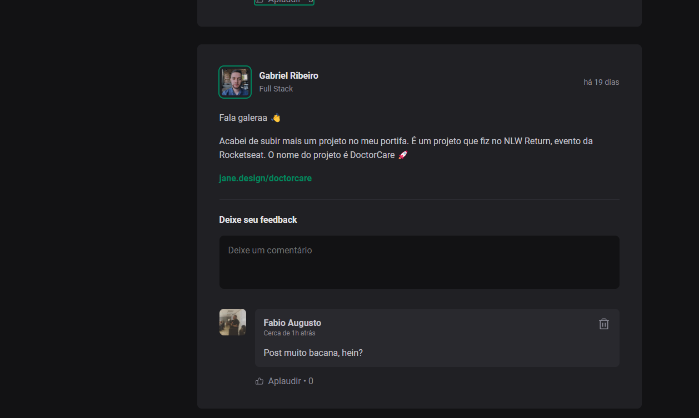

<a href="Readme-pt.md" style="color:#B0E0E6;">Portuguese</a>

# Project Delivery - Creating a Landing Page with React | Rocketseat 

This project is a fully functional blog application built using React. The main goal of this project is to demonstrate how to effectively build components and organize your React project using the tools and resources provided by the Vite framework.

## Technologies Used 
- REACT 
- CSS 
- HTML 

## How to Run the Project 

1. Clone the repository: 

   ```bash 
   git clone https://github.com/Miguelalmeida01/typeScript-cursoIgnite.git 
   ``` 
2. Navigate to the project directory: 

   ```bash 
   cd react 
   ``` 

3. Install the dependencies: 

   ```bash 
   npm i 
   ``` 

4. Download the phosphor-react library: 

   ```bash 
   npm i phosphor-react 
   ``` 

5. Access the project in the browser: 

   ```bash
   npm run dev 
   ``` 
 
 ## Web project 
 
  

  
 
  
 
 
<a href="https://github.com/Miguelalmeida01/typeScript-cursoIgnite?tab=readme-ov-file#entrega-de-projeto---criando-um-blog-com-angular--dio" style="color:#B0E0E6;" >
Back</a> 